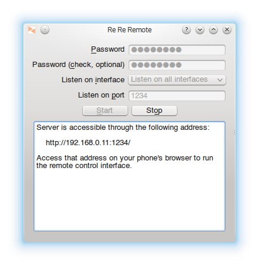
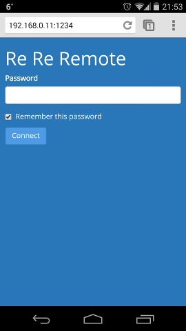
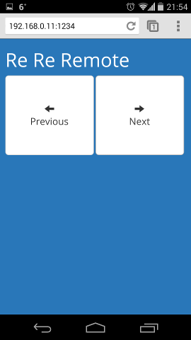

Re Re Remote
============

This is a simple presentation controller intended to be run on desktop computers and accessed from mobile devices in the same LAN (usually via Wi-Fi).

It has been tested on Windows and Linux.

Screenshots
-----------

  

Requirements
------------

 * Python 2.7+ or 3.3+.
 * PyQt4, PyQt5 or PySide.
 * [PyUserInput](https://github.com/SavinaRoja/PyUserInput)
    * PyWin32 (for Windows only)
    * PyXlib (for Linux only)
        * If using Python 3 you may need to use latest head of [LiuLang/python3-xlib](https://github.com/LiuLang/python3-xlib) as earlier versions don't work due to [this issue](https://github.com/LiuLang/python3-xlib/pull/7)
 * [netifaces](https://pypi.python.org/pypi/netifaces-merged)
 * [Tornado web server](http://www.tornadoweb.org/)

How to run on Linux
-------------------

1. Install above requirements through your usual distro channels, with the mentioned exceptions.

2. Run the following on the directory this README is placed:

        python -m rereremote.gui.main

How to run on Windows
---------------------

1. Download `rereremote_windows.zip`. Uncompress.

2. Run `rereremote_gui.exe`.

How to build on Windows
-----------------------

These instructions apply for a build of Re Re Remote using Python 3.3, PyQt 5.2 and x86 (32 bit).

These instructions have been tested on a Windows XP virtual machine (pretty old, but it works pretty well and the executables generated should work on newer Windows versions flawlessly).

**Note**: At the time of writing, cx_Freeze does not work well on Python 3.4, which has been released just a few days ago.

1. Install [Python 3.3 (32-bit)](http://www.python.org/ftp/python/3.3.5/python-3.3.5.msi). Consider adding it to `PATH`.

2. Install [PyQt5](http://www.riverbankcomputing.co.uk/software/pyqt/download5). A minimal install should suffice (although you may want to check *Developer tools* to get the Qt resource compiler).

3. Install [PyWin32](http://sf.net/projects/pywin32). You'll need to click in *Files* in order to find installers.

4. Install tornado. You can install [the version found in this page](http://www.lfd.uci.edu/~gohlke/pythonlibs/) in order to avoid building the C extension yourself.

5. Install [netifaces-merged](https://pypi.python.org/pypi/netifaces-merged), which brings Python 3 compatibility and some Windows binaries. At the time of writing there are only Python 3.3 and 32-bit binaries here, so if you choose 3.4+ or 64 bits you'll need to build them yourself, sorry.

6. Install [PyUserInput](https://github.com/SavinaRoja/PyUserInput). Download a ZIP with Github, uncompress it, `cd` to it in the console and run `python setup.py install`.

   It may throw an error about *pyHook* missing. Don't mind it, it is not used in this project.

7. Add PyQt5 package [to the system path](http://www.howtogeek.com/118594/how-to-edit-your-system-path-for-easy-command-line-access/). This is needed in order for Qt to find its plugins. The path you need to add would be something like `C:\Python33\Lib\site-packages\PyQt5`.

    Notice altering the `PATH` only affects newly opened applications. You need to close your terminals in order for them to get the new `PATH`.

8. Download this repository, `cd` to it and run `python -m rereremote.gui.main`.

    Congratulations, you got it running! You can make changes in the source now if you want.

9. Install [cx_Freeze](http://cx-freeze.sourceforge.net/).

10. Build the executables running `python setup.py build` in the project directory. They should be created in `build/exe.win32-3.3`. We will refer to this directory as the *build directory*.

11. In order for these executables to work in other machines you need to copy the following Microsoft Visual C++ redistributables into the build directory.

    * `msvcp100.dll`
    * `msvcr100.dll`

    Usually you can find these files in `C:\Windows\system32`.

12. In order for Qt not to raise an error about *Windows platform plugin missing* and quitting you need to copy `libEGL.dll` from PyQt directory (`C:\Python33\Lib\site-packages\PyQt5\libEGL.dll`) into the build directory.

And that's all! Copy or zip the build directory and you are done. Wasn't it easy?
